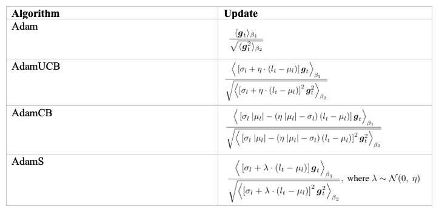
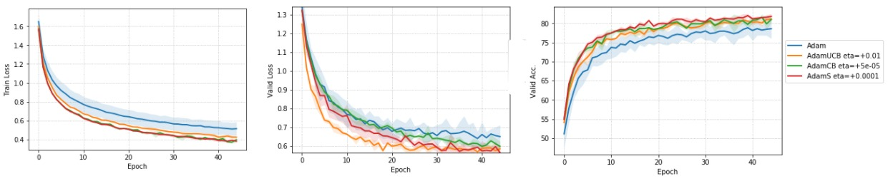
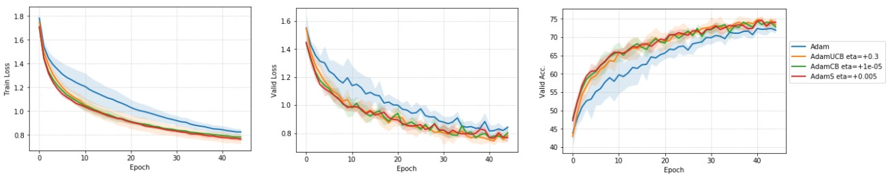
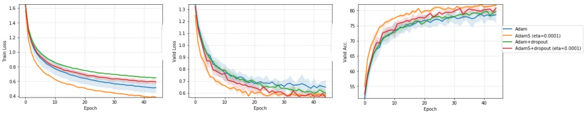

## Exploiting Uncertainty of Loss Landscape for Stochastic Optimization

Cite as: ``V.S. Bhaskara, and S. Desai. ``_``arXiv preprint``_

### Algorithm 

We introduce variants of the Adam optimizer that either bias the updates along regions that conform across mini-batches or randomly "explore" in the parameter space along the variance-gradient. The update rules are summarized below: 

  

AdamUCB and AdamCB are biased estimates of the full-gradient. We recommend using AdamS which is an unbiased estimate of the full-gradient, and outperforms other variants based on our experiments with CIFAR-10. Please refer to the paper for more details.

### Code

PyTorch implementation of the optimizers is available under [``PyTorch-Optimizers/``](PyTorch-Optimizers/)

### Usage

Each of our optimizer requires access to the current loss value. This is acheived by passing in a ``closure`` function  to the ``optimizer.step()`` method. The function ``closure()`` should be defined to return the current loss tensor after the forward pass.

Refer to lines ``351-357`` in [``Experiments/main.py``](Experiments/main.py) for an example of the usage.

### Experiments

We evaluate the optimizers on multiple models such as Logistic Regression (LR), MLPs, and CNNs on the CIFAR-10/MNIST datasets. The architecture of the networks is chosen to closely resemble the experiments published in the original Adam paper [(Kingma and Ba, 2015)](https://arxiv.org/abs/1412.6980). Code for our experiments is available under [``Experiments/``](Experiments/), and is based on the original CIFAR-10 classifier code [here](https://github.com/bearpaw/pytorch-classification).

#### Reproducing the results

* Run the shell script for each type of model (LR/MLP/CNN) under [``Experiments/``](Experiments/)
* Compute the Mean and the Standard Deviation of the training/validation metrics for each configuration across the three runs. 

Results of our training runs with the mean and the standard deviation values for each configuration is provided under [``Experiments/results_mean_std/``](Experiments/results_mean_std).

### Results

#### CNN trained on CIFAR-10 with batch size = 128 and no dropout

#### CNN trained on CIFAR-10 with batch size = 16 and no dropout

#### Comparison of Dropout with AdamS for CNN trained on CIFAR-10 with batch size = 128 

Please refer to the paper for more details.

### Contribute
Feel free to create a pull request if you find any bugs or you want to contribute (e.g., more datasets, more network structures, or tensorflow/keras ports). 
